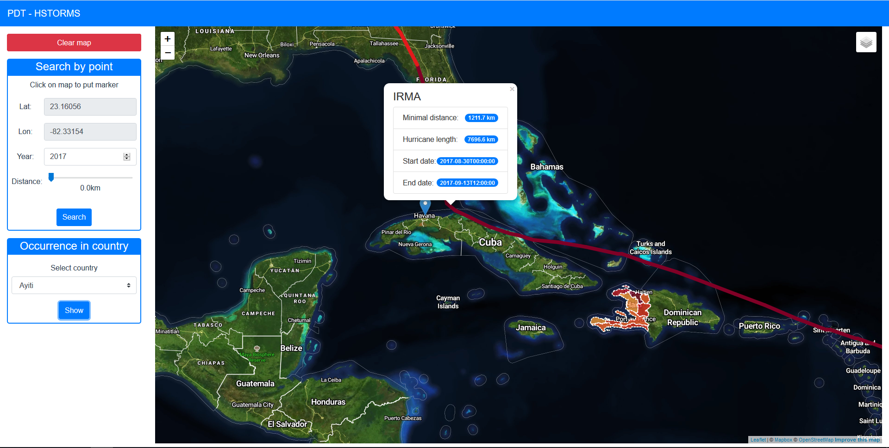

*This is a documentation for a fictional project, just to show you what I expect. Notice a few key properties:*
- *no cover page, really*
- *no copy&pasted assignment text*
- *no code samples*
- *concise, to the point, gets me a quick overview of what was done and how*
- *I don't really care about the document length*
- *I used links where appropriate*

# Overview

This application shows historical hurricane track in Atlantic ocean. Most important features are:
- search nearest hurricane to selected point
- search hurricanes which has crossed selected area
- show hurricane occurrence map for selected country

This is it in action:



The application has 3 separate parts:
- the client which is a [frontend web application](#frontend) written in [Vue.js](https://vuejs.org/),
- the [backend application](#backend) written in [Python](https://www.python.org/),
- [database](#database) with spatial data in [PostgreSQL](https://www.postgresql.org/).

The frontend application communicates with backend using a [REST API](#api).

# Frontend

The frontend application is single page application (SPA), written in Vue.js.  It is displaying hurricane tracks using [Vue2Leaflet](https://github.com/KoRiGaN/Vue2Leaflet). Mapbox API is used to get baselayer of map. I modified the style to better highlight country/country region boundaries, since they are important when showing hurricane occurrence map.

All relevant frontend code is in `fe/` folder. The frontend code responsibilities are:
- displaying the sidebar panel with select point controls and country list, driving the user interaction and calling the appropriate backend APIs
- displaying geo features by overlaying the map with a geojson layer, the geojson is provided directly by backend APIs

# Database

Hurricane data are imported from [hurdat2](https://www.nhc.noaa.gov/data/hurdat/hurdat2-1851-2017-050118.txt) using `db/hurdat2sql.py`, which generates `hurdat_schema.sql`.

Country data is coming directly from Open Street Maps. I downloaded an extent covering whole Central America and imported it using the `osm2pgsql` tool into the standard OSM schema in WGS 84. To speedup the queries I created indexes and materialized views defined in `db/perf_boost.sql`. GeoJSON is generated by using a standard `st_asgeojson` function.

# Backend

The backend application is written in Python using [Quart](https://gitlab.com/pgjones/quart) web microframework and is responsible for querying geo data, formatting the geojson and data for the sidebar panel. [asyncpg](https://github.com/MagicStack/asyncpg) is used for communication with databse. 

Application consists of 2 layers:
- controllers (`be/hstorms/controller`) - handles API request calls
- repositories (`be/hstorms/repository`) - executes SQL queries and postprocess results from [database](#database) to appropriate format

## Api

**Find all countries in database**

`GET /countries`

**Find closest hurricane track to selected point**

`GET /hurricanes/point?&lat=2534&lon=4634&distance=0&year=2017`
- `lat` - latitude of selected point
- `lon` - longitude of selected point
- `distance` - if > 0 search all hurricanes, which crossed in `distance` from selected point
- `year` - year to search hurricane, if missing search all years

**Count occurrence in selected country/country regions**

`GET /hurricanes/occurrence?countryId=3245`

**Get info about hurricane**

`GET /hurricanes/2313/info`

### Response

API calls return json responses either in JSON or [GeoJSON](http://geojson.org/) format.

Example JSON:
```
{
  "endDate": "2017-09-13T12:00:00", 
  "hurricaneId": 1469, 
  "hurricaneLength": 7696590.530752462, 
  "name": "IRMA", 
  "startDate": "2017-08-30T00:00:00"
}
```

Example GeoJSON:
```
{
  "features":[
     {
        "geometry":{
           "coordinates":[
              [-26.9, 16.1],
              [-28.3, 16.2]
           ],
           "type":"LineString"
        }
        "type":"Feature"
     }
  ],
  "properties":{
     "hurricaneId":1469,
     "name":"IRMA"
  },
  "type":"FeatureCollection"
}
```


